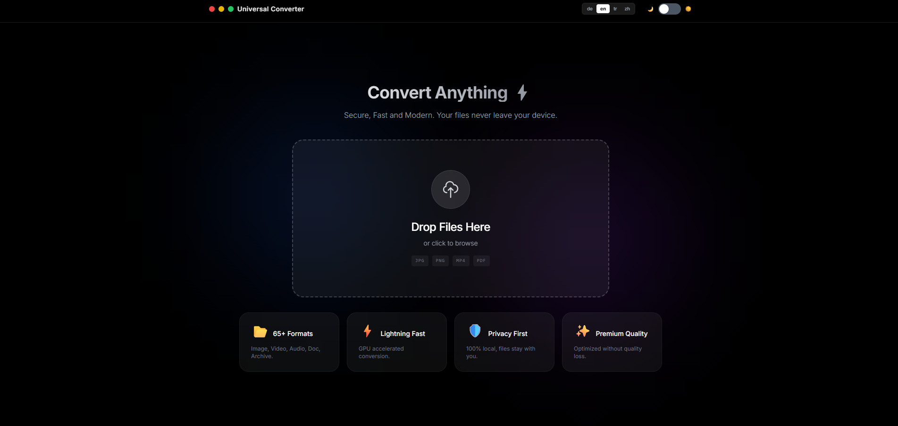

# 🌐 Universal Converter V2.0

<div align="center">



**Secure, Fast, and Modern File Converter**

[](LICENSE)
[](https://www.python.org/)
[](https://fastapi.tiangolo.com/)

[English](#english) • [Türkçe](#türkçe) • [Deutsch](#deutsch) • [中文](#中文)

</div>

---

## English

### ✨ Features

- **65+ Format Support**: Image, Video, Audio, Document, Archive, Data
- **100% Local**: Your files never leave your device
- **Lightning Fast**: GPU-accelerated conversion with FFmpeg
- **Modern UI**: Apple-inspired design with Light/Dark mode
- **Multi-language**: English, Turkish, German, Chinese
- **Batch Processing**: Convert multiple files at once
- **Drag & Drop**: Simply drop files to convert
- **Privacy First**: No tracking, no cloud, completely offline

### 📁 Supported Formats

| Category | Formats |
|----------|---------|
| **Image** | JPG, PNG, WEBP, HEIC, SVG, ICO, TIFF, BMP, GIF |
| **Video** | MP4, MKV, AVI, MOV, WEBM (requires FFmpeg) |
| **Audio** | MP3, WAV, FLAC, M4A, OGG, AAC |
| **Document** | PDF ↔ DOCX, DOC, TXT, HTML, MD, RTF |
| **Data** | CSV ↔ Excel, JSON, XML |
| **Archive** | ZIP, 7Z, TAR, GZ (extract & create) |

### 🛠️ Installation

**1. Install Python 3.8 or higher**

**2. Install FFmpeg (Required for Video/Audio)**
```bash
# Windows
winget install ffmpeg

# macOS
brew install ffmpeg

# Linux (Ubuntu/Debian)
sudo apt install ffmpeg
```

**3. Clone and Install**
```bash
git clone https://github.com/YusufEren97/universal-converter.git
cd universal-converter
pip install -r requirements.txt
```

### 🚀 Usage

**Start the server:**
```bash
python -m uvicorn app.main:app --reload --port 9999
```

Or on Windows, simply run `Start.bat`

**Access the app:**
```
http://localhost:9999
```

### 🎯 What's New in V2.0

- ✅ Complete UI/UX redesign with glassmorphism
- ✅ Multi-language support (4 languages)
- ✅ Batch format application
- ✅ Progress tracking for batch operations
- ✅ Improved error handling with retry functionality
- ✅ Theme persistence (Light/Dark)
- ✅ Language persistence
- ✅ Enhanced mobile responsiveness
- ✅ Native select dropdowns with proper dark mode
- ✅ File type icons and visual feedback

### 🏗️ Project Structure

```
universal-converter/
├── app/
│   ├── main.py          # FastAPI application
│   └── converters/      # Format converters
├── static/
│   ├── index.html       # Main UI
│   ├── style.css        # Styling
│   ├── script.js        # Frontend logic
│   └── locales/         # Translation files
│       ├── en.json      # English
│       ├── tr.json      # Turkish
│       ├── de.json      # German
│       └── zh.json      # Chinese
├── screenshot/          # Screenshots
├── requirements.txt     # Python dependencies
└── README.md           # You are here!
```

### 🔒 Privacy & Security

- **100% Local Processing**: All conversions happen on your device
- **No Data Upload**: Files never leave your computer
- **No Tracking**: We don't collect any analytics or usage data
- **Open Source**: Full transparency, inspect the code yourself

### 📄 License

MIT License - See [LICENSE](LICENSE) file for details

### 🙏 Credits

Built with:
- [FastAPI](https://fastapi.tiangolo.com/) - Modern Python web framework
- [Pillow](https://python-pillow.org/) - Image processing
- [FFmpeg](https://ffmpeg.org/) - Multimedia processing
- [python-docx](https://python-docx.readthedocs.io/) - Document conversion
- [Tailwind CSS](https://tailwindcss.com/) - UI framework

---

## Türkçe

### ✨ Özellikler

- **65+ Format Desteği**: Resim, Video, Ses, Belge, Arşiv, Veri
- **%100 Yerel**: Dosyalarınız cihazınızdan çıkmaz
- **Işık Hızında**: FFmpeg ile GPU hızlandırmalı dönüştürme
- **Modern Arayüz**: Açık/Koyu mod destekli şık tasarım
- **Çok Dilli**: Türkçe, İngilizce, Almanca, Çince
- **Toplu İşlem**: Birden fazla dosyayı aynı anda dönüştürün
- **Sürükle Bırak**: Dosyaları bırakmanız yeterli
- **Gizlilik Öncelikli**: Takip yok, bulut yok, tamamen çevrimdışı

### 📁 Desteklenen Formatlar

| Kategori | Formatlar |
|----------|-----------|
| **Resim** | JPG, PNG, WEBP, HEIC, SVG, ICO, TIFF, BMP, GIF |
| **Video** | MP4, MKV, AVI, MOV, WEBM (FFmpeg gerektirir) |
| **Ses** | MP3, WAV, FLAC, M4A, OGG, AAC |
| **Belge** | PDF ↔ DOCX, DOC, TXT, HTML, MD, RTF |
| **Veri** | CSV ↔ Excel, JSON, XML |
| **Arşiv** | ZIP, 7Z, TAR, GZ (çıkarma ve oluşturma) |

### 🛠️ Kurulum

**1. Python 3.8 veya üstünü yükleyin**

**2. FFmpeg Yükleyin (Video/Ses için gerekli)**
```bash
# Windows
winget install ffmpeg

# macOS
brew install ffmpeg

# Linux (Ubuntu/Debian)
sudo apt install ffmpeg
```

**3. Klonlayın ve Kurun**
```bash
git clone https://github.com/YusufEren97/universal-converter.git
cd universal-converter
pip install -r requirements.txt
```

### 🚀 Kullanım

**Sunucuyu başlatın:**
```bash
python -m uvicorn app.main:app --reload --port 9999
```

Veya Windows'ta `Start.bat` dosyasına çift tıklayın

**Uygulamaya erişin:**
```
http://localhost:9999
```

### 🎯 V2.0'daki Yenilikler

- ✅ Glassmorphism ile tamamen yenilenmiş UI/UX
- ✅ Çok dilli destek (4 dil)
- ✅ Toplu format uygulama
- ✅ Batch işlemler için ilerleme takibi
- ✅ Yeniden deneme özelliği ile gelişmiş hata yönetimi
- ✅ Tema kalıcılığı (Açık/Koyu)
- ✅ Dil kalıcılığı
- ✅ Geliştirilmiş mobil uyumluluk
- ✅ Koyu mod destekli native select dropdown'lar
- ✅ Dosya tipi ikonları ve görsel geri bildirim

### 🔒 Gizlilik ve Güvenlik

- **%100 Yerel İşlem**: Tüm dönüşümler cihazınızda gerçekleşir
- **Veri Yükleme Yok**: Dosyalar bilgisayarınızdan çıkmaz
- **Takip Yok**: Analitik veya kullanım verisi toplamıyoruz
- **Açık Kaynak**: Tam şeffaflık, kodu kendiniz inceleyebilirsiniz

---

## Deutsch

### ✨ Funktionen

- **65+ Format-Unterstützung**: Bild, Video, Audio, Dokument, Archiv, Daten
- **100% Lokal**: Ihre Dateien verlassen nie Ihr Gerät
- **Blitzschnell**: GPU-beschleunigte Konvertierung mit FFmpeg
- **Modernes UI**: Apple-inspiriertes Design mit Hell-/Dunkelmodus
- **Mehrsprachig**: Englisch, Türkisch, Deutsch, Chinesisch
- **Stapelverarbeitung**: Mehrere Dateien gleichzeitig konvertieren
- **Drag & Drop**: Einfach Dateien ablegen zum Konvertieren
- **Datenschutz zuerst**: Kein Tracking, keine Cloud, vollständig offline

### 📁 Unterstützte Formate

| Kategorie | Formate |
|-----------|---------|
| **Bild** | JPG, PNG, WEBP, HEIC, SVG, ICO, TIFF, BMP, GIF |
| **Video** | MP4, MKV, AVI, MOV, WEBM (erfordert FFmpeg) |
| **Audio** | MP3, WAV, FLAC, M4A, OGG, AAC |
| **Dokument** | PDF ↔ DOCX, DOC, TXT, HTML, MD, RTF |
| **Daten** | CSV ↔ Excel, JSON, XML |
| **Archiv** | ZIP, 7Z, TAR, GZ (extrahieren & erstellen) |

### 🛠️ Installation

**1. Python 3.8 oder höher installieren**

**2. FFmpeg installieren (Erforderlich für Video/Audio)**
```bash
# Windows
winget install ffmpeg

# macOS
brew install ffmpeg

# Linux (Ubuntu/Debian)
sudo apt install ffmpeg
```

**3. Klonen und Installieren**
```bash
git clone https://github.com/YusufEren97/universal-converter.git
cd universal-converter
pip install -r requirements.txt
```

### 🚀 Verwendung

**Server starten:**
```bash
python -m uvicorn app.main:app --reload --port 9999
```

Oder unter Windows einfach `Start.bat` ausführen

**App aufrufen:**
```
http://localhost:9999
```

---

## 中文

### ✨ 功能特点

- **支持65+格式**: 图像、视频、音频、文档、存档、数据
- **100%本地**: 您的文件永不离开设备
- **闪电般快速**: FFmpeg GPU加速转换
- **现代UI**: Apple风格设计，支持浅色/深色模式
- **多语言**: 英语、土耳其语、德语、中文
- **批量处理**: 一次转换多个文件
- **拖放**: 只需拖放文件即可转换
- **隐私第一**: 无跟踪、无云端、完全离线

### 📁 支持的格式

| 类别 | 格式 |
|------|------|
| **图像** | JPG, PNG, WEBP, HEIC, SVG, ICO, TIFF, BMP, GIF |
| **视频** | MP4, MKV, AVI, MOV, WEBM (需要FFmpeg) |
| **音频** | MP3, WAV, FLAC, M4A, OGG, AAC |
| **文档** | PDF ↔ DOCX, DOC, TXT, HTML, MD, RTF |
| **数据** | CSV ↔ Excel, JSON, XML |
| **存档** | ZIP, 7Z, TAR, GZ (提取和创建) |

### 🛠️ 安装

**1. 安装 Python 3.8 或更高版本**

**2. 安装 FFmpeg (视频/音频转换必需)**
```bash
# Windows
winget install ffmpeg

# macOS
brew install ffmpeg

# Linux (Ubuntu/Debian)
sudo apt install ffmpeg
```

**3. 克隆并安装**
```bash
git clone https://github.com/YusufEren97/universal-converter.git
cd universal-converter
pip install -r requirements.txt
```

### � 使用

**启动服务器:**
```bash
python -m uvicorn app.main:app --reload --port 9999
```

或在Windows上运行 `Start.bat`

**访问应用:**
```
http://localhost:9999
```

---

<div align="center">

### Made with ❤️ for the community

**Star ⭐ this repo if you find it useful!**

</div>
